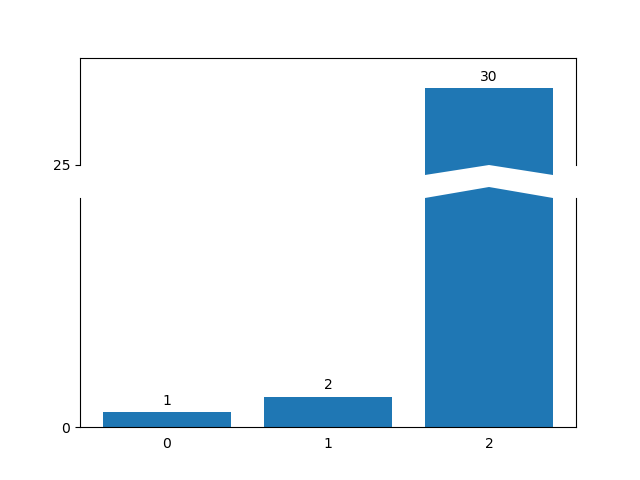
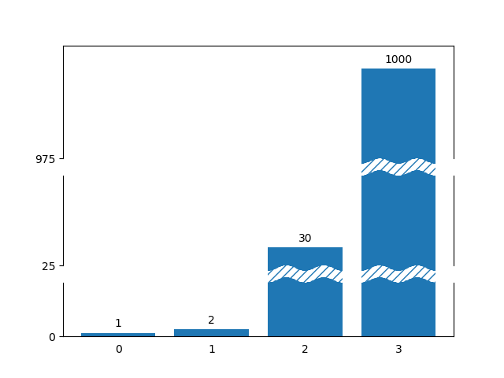

# PlotInPy

This is a collection of plotting functions that I am creating
to contain everything I find useful on the topic of plotting in Python.
These are not code snippets though.
Each function is intended to be as robust as possible,
to support (for example) being used inside subplots, using gridspecs,
and so on. Maybe they are not perfect... yet! The intention is
to improve them until they are.

## Examples

### Broken bars

    plt.figure()
    pnp.plot_bars_with_breaks([1,2,30],[(15,25)])
    plt.savefig("img/example1.png")

### Styled broken bars

    plt.figure()
    pnp.plot_bars_with_breaks([1,2,30, 1000],[(15,25), (50, 975)], style="~~", break_args={"hatch": '///'})
    plt.savefig("img/example2.png")

